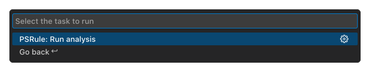

# Run analysis

Run tasks within Visual Studio Code to analyze the Infrastructure as Code within your workspace.

## Run tasks

- Open the **Command Palette** (Ctrl+Shift+P) and select **Tasks: Run Task**.
- Choose or type **PSRule**.
- Then select **PSRule: Run analysis**.
- Optionally, select **PSRule** to scan the task output to collect error or warnings.

## Configuring tasks

Additional configuration options can be set on the **PSRule: Run analysis** task.
Such as the input path, modules, baseline, and additional environment variables by configuring the `tasks.json`.
